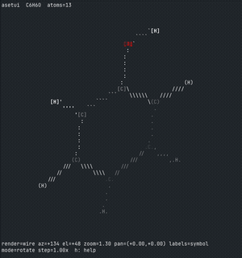
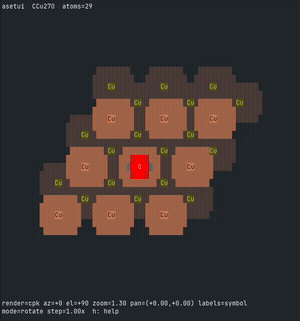
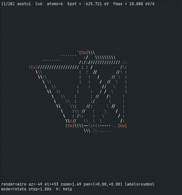
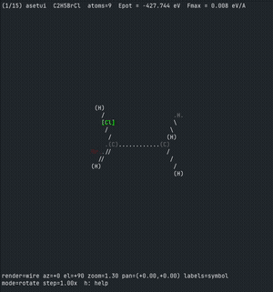

# asetui

`asetui` is a lightweight terminal viewer for ASE `Atoms` objects. It lets you inspect molecules, slabs, and trajectories locally or over SSH, without a GUI, X11, or a display server.

## Gallery


| Molecule | Surface | Relax | IRC |
|--|--|--|--|
|  |  |  |  |

## Features

- Reads all ASE-supported formats (`xyz`, `cif`, `vasp`, etc)
- Runs entirely in the terminal over any SSH connection
- Interactive rotation, translation, and zoom
- Preset views: front (`1`), side (`2`), top (`3`)
- Label modes: element symbol, index, or off
- Trajectory navigation with `[` / `]`

## Install

```bash
pip install --user git+https://github.com/zishengz/asetui
```

From a local clone:

```bash
pip install -e .
```

### Making `atui` available in your shell

`pip install --user` places `atui` in `~/.local/bin` (Linux) or
`~/Library/Python/<version>/bin` (macOS). If needed, add that directory to your
`PATH`:

```bash
export PATH="$HOME/.local/bin:$PATH"
```

On HPC clusters or in conda/venv installs, the script is usually in
`<prefix>/bin`; add that to `PATH` or call `atui` with the full path.

## Usage

```bash
atui examples/phenol.xyz                   # single molecule
atui examples/Cu111_CO.vasp                # slab in VASP format
atui examples/sn2_irc.xyz                  # trajectory
atui examples/Cu4_opt_traj.xyz.gz          # gzipped trajectory
atui examples/Cu4_opt_traj.xyz.gz@::3      # every 3rd frame
atui examples/Cu4_opt_traj.xyz.gz@:5       # first 5 frames
atui examples/Cu4_opt_traj.xyz.gz@-1       # last frame only
```

## Controls

| Key | Action |
|-----|--------|
| `r` / `t` | rotate / translate mode |
| Arrow keys | rotate or pan |
| `1` / `2` / `3` | preset views: front / side / top |
| `=` / `-` | zoom in / out |
| `<` / `>` | change step size |
| `[` / `]` | previous / next frame (trajectories) |
| `l` | cycle labels: symbol → index → off |
| `0` | cycle render modes |
| `h` | show / hide key reference |
| `c` | reset view |
| `q` | quit |

## Render Modes

- `wire`: character-based view with bonds and depth cues
- `ballstick`: filled atom blobs with split-color bonds
- `cpk`: space-filling view with atom size based on covalent radius

## To-dos

- [ ] Manipulation of structures
- [ ] File IO
- [ ] TBD

## License

[MIT License](LICENSE). Copyright (c) 2026 Zisheng Zhang (Stanford).
